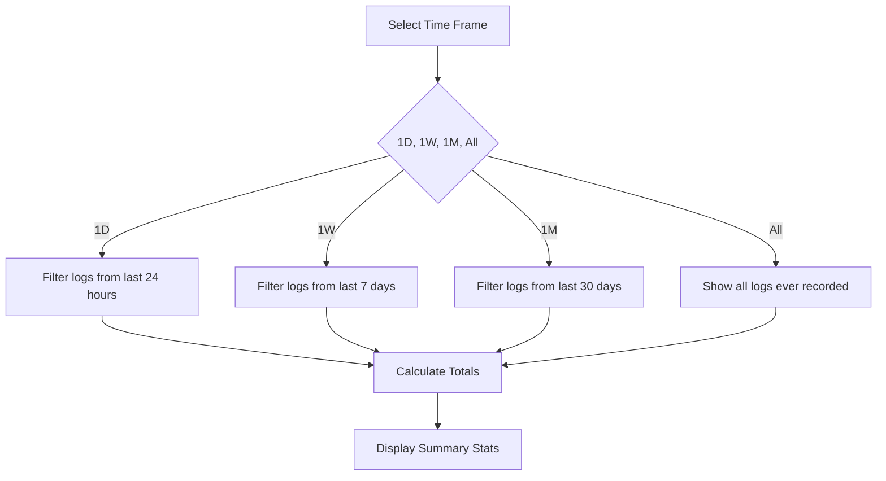

The Analytics dashboard gives you a comprehensive view of your nutrition habits, spending patterns, and health trends over time.

## Accessing Analytics

Tap the **Analytics** tab in the bottom navigation bar to view your personalized dashboard.

## Dashboard Overview

The Analytics screen is organized into sections:

<CardGroup cols={2}>
  <Card title="Tips for You" icon="lightbulb">
    Helpful advice and recommendations
  </Card>
  <Card title="Weight Over Time" icon="chart-line">
    Track your weight and BMI history
  </Card>
</CardGroup>

## Tips & Insights

At the top of the Analytics screen, you'll find a grid of helpful tips:

<Info>
Tips provide actionable advice to improve your tracking accuracy and health outcomes.
</Info>

### Example Tips

- "Log your meals consistently for best results."
- "Aim for a balanced intake of protein, carbs, and fat."
- "Review your weekly calorie trends to spot patterns."
- "Weigh your food for more accurate tracking."
- "Drink plenty of water throughout the day."
- "Try to log food right after eating to avoid forgetting."

<Note>
Tips are currently static but will become AI-generated and personalized based on your specific data in future updates.
</Note>

## Summary Statistics

The home screen (not analytics tab) provides quick summary views of your nutrition data:

### Time Frame Selection

View your statistics across different periods:

<Tabs>
  <Tab title="1D (One Day)">
    Summary of today's food logs, spending, and nutrition.
  </Tab>
  
  <Tab title="1W (One Week)">
    Last 7 days of data - great for seeing weekly patterns.
  </Tab>
  
  <Tab title="1M (One Month)">
    Last 30 days - ideal for tracking monthly progress.
  </Tab>
  
  <Tab title="All">
    Complete history since you started using CalPal.
  </Tab>
</Tabs>

### Metrics Displayed

<CardGroup cols={3}>
  <Card title="Total Spent" icon="dollar-sign">
    Sum of all food costs in the selected time period
  </Card>
  <Card title="Est. Weight Change" icon="weight-scale">
    Calculated from total calorie intake (3500 cal ≈ 1 lb)
  </Card>
  <Card title="Total Calories" icon="fire">
    Sum of all calories logged
  </Card>
  <Card title="Total Fat" icon="droplet">
    Total fat consumed in grams
  </Card>
  <Card title="Total Carbs" icon="bread-slice">
    Total carbohydrates in grams
  </Card>
  <Card title="Total Protein" icon="drumstick-bite">
    Total protein consumed in grams
  </Card>
</CardGroup>

## Weight Over Time Chart

Track your weight trends with an interactive chart:

<Steps>
  <Step title="Navigate to Analytics">
    Open the Analytics tab from the bottom navigation.
  </Step>
  
  <Step title="Expand Weight Over Time">
    The "Weight Over Time" section is a collapsible panel. Tap to expand if collapsed.
  </Step>
  
  <Step title="Select Time Range">
    Choose your view:
    - **1W** - Last 7 days
    - **1M** - Last 30 days
    - **1Y** - Last 365 days
    - **ALL** - Complete weight history
  </Step>
  
  <Step title="Interact with Chart">
    Tap any data point on the line chart to see exact details:
    - Date of measurement
    - Weight (in your chosen unit system)
    - BMI at that time
  </Step>
</Steps>

### Chart Features

**Visual Design:**
- Gradient line from top (70% opacity) to bottom (10% opacity)
- Color-coded to match your BMI category
- Smooth bezier curves for easier reading
- Date labels along the bottom axis

**Interactive:**
- Tap data points to see full details in a popup
- Transparent tap targets (7px radius) over each point
- Smaller visual dots (3.5px) with stroke outline

**Smart Filtering:**
- Automatically filters BMI history based on selected time range
- Shows "Not enough data for graph" if fewer than 2 data points
- Requires at least 2 weight entries to display

<Tip>
For best results, update your profile weekly. This creates enough data points to see meaningful trends on the weight chart.
</Tip>

## Understanding Estimated Weight Change

The "Est. Weight Change" metric uses a simplified calculation:

```text
Estimated Weight Change = Total Calories ÷ 3500 kcal/lb
```

For example:
- 7000 calories logged = +2.00 lb estimated gain
- 3500 calories logged = +1.00 lb estimated gain
- 1750 calories logged = +0.50 lb estimated gain

<Warning>
This is a **theoretical estimate** that only considers food intake. It doesn't account for:
- Your basal metabolic rate (BMR)
- Physical activity and exercise
- Water retention
- Individual metabolism

Use it as a rough guideline, not an exact prediction.
</Warning>

## Spending Analysis

Track your food spending over time:

- **Total Spent** shows the sum of all food costs
- Filter by time frame to see daily, weekly, or monthly spending
- Compare spending across different periods
- Identify expensive eating patterns

<Tip>
Set a weekly food budget and use the 1W view to track if you're staying on target.
</Tip>

## Nutrition Tracking

Monitor your macronutrient intake:

### Macronutrients Displayed

- **Total Fat** (grams)
- **Total Carbs** (grams)
- **Total Protein** (grams)

These update automatically based on your selected time frame.

### Macro Balance

<Info>
A balanced diet typically includes:
- **Protein**: 10-35% of calories
- **Carbs**: 45-65% of calories
- **Fat**: 20-35% of calories

Use your totals to calculate percentages and ensure balanced nutrition.
</Info>

## Time Range Filtering

All analytics use the same time range selector on the home screen:



## Future Analytics Features

<Note>
Upcoming enhancements to the analytics dashboard:

- **AI-Generated Insights** - Personalized tips based on your actual data
- **Calorie vs Goal Tracking** - Set targets and see progress
- **Macro Ratio Pie Charts** - Visual breakdown of protein/carbs/fat
- **Streak Tracking** - Consecutive days logged
- **Meal Timing Analysis** - When you eat most of your calories
- **Nutrition Score** - Overall diet quality rating
- **Export Data** - Download your logs as CSV
</Note>

## Reading the Weight Chart

### Chart Example

```text
Weight (lbs)
  |
185 ●━━━━━━●
  |        ╱  ╲
180 |    ●╱      ╲●
  |   ╱            ╲
175 ●╱                ●
  |_____________________
   Mon  Wed  Fri  Sun
```

**Interpreting the chart:**
- **Rising trend** = Weight increasing
- **Falling trend** = Weight decreasing
- **Flat line** = Stable weight
- **Data points** = Individual profile updates

<Tip>
Weight naturally fluctuates 2-4 lbs day-to-day due to water, food in digestive system, etc. Focus on the overall trend line, not individual points.
</Tip>

## BMI History Details

When you tap a data point on the weight chart, you see:

```text
Date: 2024-03-15
Weight: 178.5 lbs
BMI: 25.6
```

- **Date** - When this weight was recorded
- **Weight** - Your weight in your chosen unit system
- **BMI** - Body Mass Index at that time

This helps you track not just weight, but overall body composition trends.

## Using Analytics for Goal Setting

<Steps>
  <Step title="Review Your Baseline">
    Look at your "All" time statistics to understand your typical eating patterns.
  </Step>
  
  <Step title="Set Specific Goals">
    Example goals:
    - Increase protein to 150g/day
    - Reduce daily calories to 2000
    - Limit weekly food spending to $100
  </Step>
  
  <Step title="Track Weekly Progress">
    Use the 1W view to monitor if you're hitting your targets each week.
  </Step>
  
  <Step title="Adjust as Needed">
    If you're not meeting goals, review your food logs to identify patterns and make changes.
  </Step>
</Steps>

## Tips for Better Analytics

<Tip>
**Log Consistently** - The more data you have, the more accurate your analytics become. Try to log every meal.
</Tip>

<Tip>
**Update Profile Weekly** - Regular weight updates enable meaningful weight trend analysis.
</Tip>

<Tip>
**Use All Logging Methods** - Combine barcode scanning, AI entry, and manual logs for comprehensive tracking.
</Tip>

<Tip>
**Review Weekly** - Check your 1W summary every Sunday to review the past week and plan ahead.
</Tip>

## Data Visualization

The analytics system uses:

- **SVG Charts** - Scalable, smooth line graphs with gradients
- **Color Coding** - BMI-based colors (blue, green, orange, red)
- **Interactive Elements** - Touchable data points with popups
- **Responsive Scaling** - Automatically adjusts to your data range

<Info>
The weight chart uses react-native-svg for high-quality, performant visualizations that work on both iOS and Android.
</Info>

## Privacy in Analytics

All analytics calculations happen locally on your device:

- No data is sent to external servers
- Charts are generated from local database queries
- Your nutrition and health data stays private
- No third-party analytics or tracking

<Note>
See the [Health Tracking](/features/health-tracking) page for more about data privacy and local storage.
</Note>